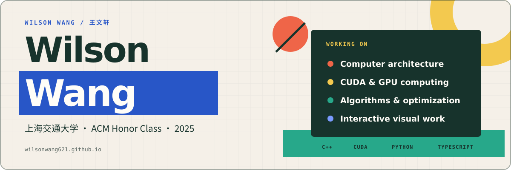
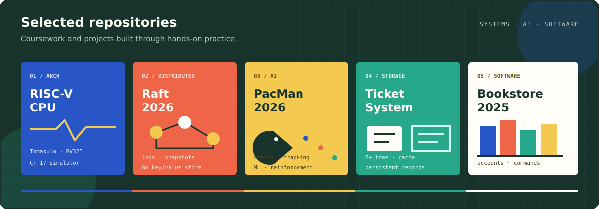

  

  <a href="https://wilsonwang621.github.io/">Website</a> ·
  <a href="https://wilsonwang621.github.io/blog/">Writing</a> ·
  <a href="https://wilsonwang621.github.io/projects/">Projects</a> ·
  <a href="mailto:200706215314@sjtu.edu.cn">Email</a>

## About me

Hi, I'm Wenxuan Wang, an undergraduate student majoring in Computer Science in the ACM Honors Class at Zhiyuan College, Shanghai Jiao Tong University. After completing my first year, I have become especially interested in the evolving relationship between humans and artificial intelligence: what each can do, how their roles may change, and how advances in AI may shape our future.

I enjoy turning broad questions into concrete problems, then exploring possible answers through continuous learning and hands-on practice. My current academic interests lie primarily in AI for Science and at the intersection of computer systems and chip design, particularly hardware–software co-design. I am continuing to build the mathematical, systems, and hardware foundations needed to explore these fields more deeply.

Outside academics, I enjoy running, basketball, football, and tennis. I look forward to continuing to learn, embracing new challenges, and growing into a better version of myself.

  

## Selected repositories

| Repository | Focus |
| --- | --- |
| [RISC-V-CPU-Simulator](https://github.com/WilsonWang621/RISC-V-CPU-Simulator) | A C++17 simulator for RV32I out-of-order execution with Tomasulo scheduling, precise recovery, LSQ/CDB behavior, and branch prediction. |
| [Raft-2026](https://github.com/WilsonWang621/Raft-2026) | A Go implementation of Raft-based replication, covering leader election, log replication, snapshots, failure handling, and a key/value service. |
| [PacMan-2026](https://github.com/WilsonWang621/PacMan-2026) | Course projects around search, multi-agent decision making, probabilistic tracking, machine learning, and reinforcement learning. |
| [Ticket-System-2026](https://github.com/WilsonWang621/Ticket-System-2026) | A persistent ticket system with disk-based data structures, B+ tree indexing, LRU caching, ticket management, and waitlist workflows. |
| [Bookstore-2025](https://github.com/WilsonWang621/Bookstore-2025) | A bookstore management system focused on command parsing, account and privilege control, persistent storage, and transaction records. |

## Writing and notes

Longer course notes and project write-ups live on [my website](https://wilsonwang621.github.io/). Recent subjects include mathematical analysis, computer architecture, systems programming, and algorithm implementations.

[Blog](https://wilsonwang621.github.io/blog/) · [Project index](https://wilsonwang621.github.io/projects/) · [Algorithms](https://wilsonwang621.github.io/algorithms/)

## Working set

`C++` · `C` · `CUDA` · `Python` · `Go` · `TypeScript` · `PyTorch` · `CMake` · `Linux` · `Git`

---

Shanghai, China · <a href="mailto:200706215314@sjtu.edu.cn">200706215314@sjtu.edu.cn</a>
